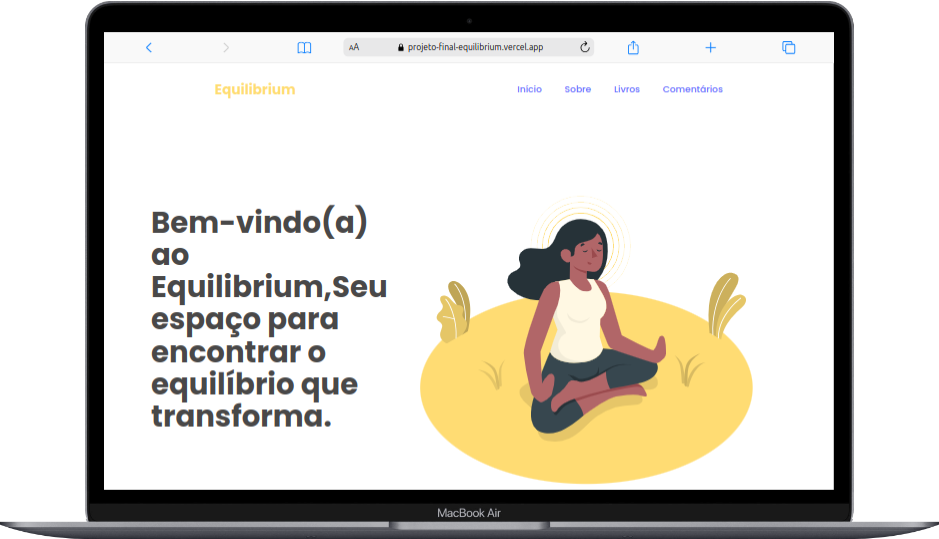
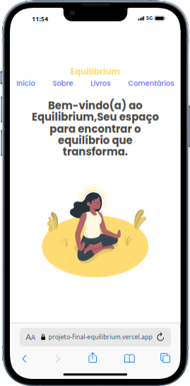

# Equilibrium

Equilibrium é uma plataforma dedicada a fornecer informações e recomendações sobre saúde mental e bem-estar. Nosso objetivo é ajudar os usuários com sugestões de leitura e comentários positivos.

## Sumário:

- [Imagens do projeto](#imagens-do-projeto)
- [Construído com as Tecnologias](#🛠️-construído-com-as-tecnologias)
- [Instruções de Instalação](#instruções-de-instalação)
  - [Passo 1: Clonar o Repositório](#passo-1-clonar-o-repositório)
  - [Passo 2: Instale as Dependências](#passo-2-instale-as-dependências)
  - [Passo 3: Iniciar o Servidor](#passo-4-iniciar-o-servidor)
- [API utilizada](#api-utilizada)
- [Deploy do projeto](#deploy-do-projeto)
- [Apresentação Linkedin](#apresentação-linkedin)
- [Contribuição](#contribuição)
- [Licença](#licença)

## Imagens do projeto:

|  |  |
| --------------------------------------------------------------------- | ----------------------------------------------------------------------- |

## 🛠️ Construído com as Tecnologias:

- JavaScript
- React
- Vite
- Node.js
- Express

## Instruções de Instalação:

### Passo 1: Clonar o Repositório

```
git clone https://github.com/maeldsoncavalcante100/projeto-final-Equilibrium.git

cd projeto-final-Equilibrium

cd Equilibrium
```

### Passo 2: Instale as Dependências:

```
npm install
```

### Passo 4: Iniciar o Servidor

```
npm run dev
```

O servidor estará rodando em http://localhost:5173/

## API utilizada:

```
https://projeto-final-m4-pda.onrender.com/
```

## Deploy do projeto:

```
https://projeto-final-equilibrium.vercel.app/
```

## Apresentação Linkedin:

```
https://www.linkedin.com/posts/maeldsoncavalcante_apresenta%C3%A7%C3%A3o-activity-7251645650260426752-VZ31?utm_source=share&utm_medium=member_desktop
```

## Contribuição:

Sinta-se à vontade para contribuir! Abra um _pull request_ ou envie um _issue_ para sugestões ou correções.

## Licença:

Este projeto está licenciado sob a [Licença MIT](LICENSE).